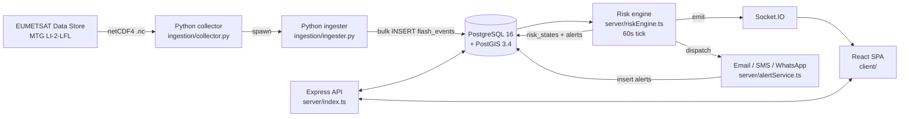
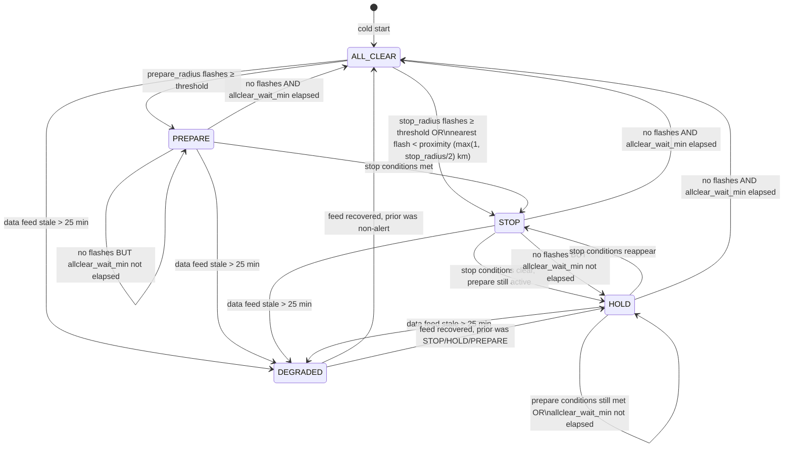
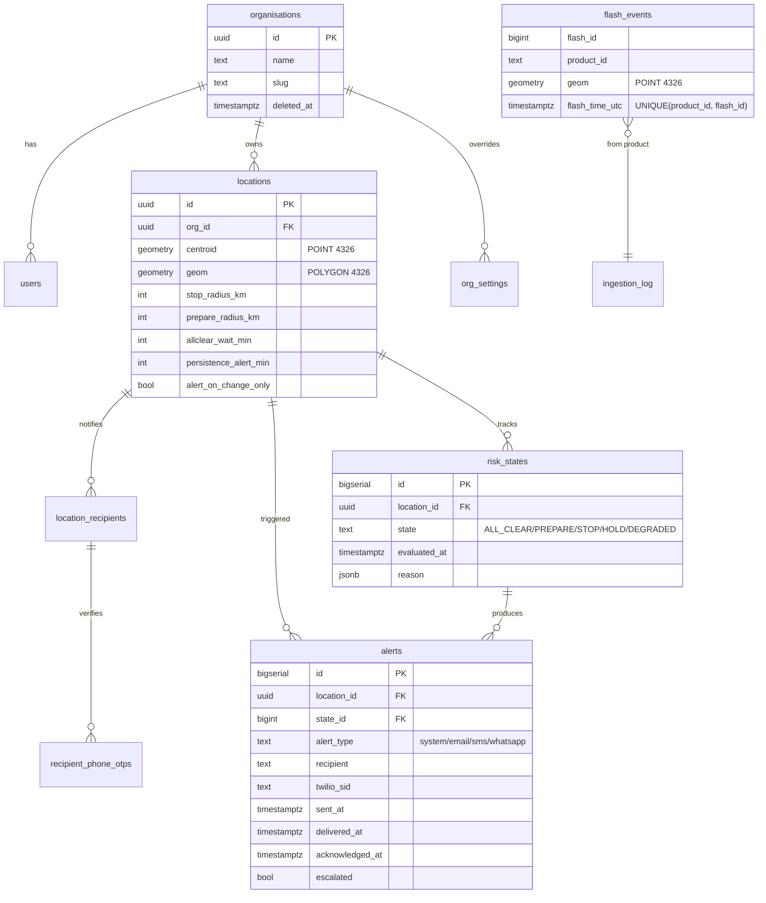
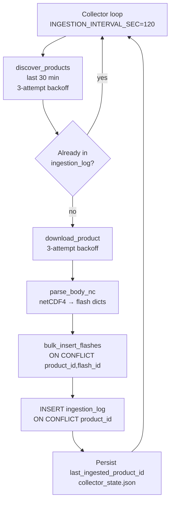

# FlashAware — Architecture

A reference for engineers and on-call operators. For deployment runbook
see `docs/OPERATIONS.md`. For local setup see `SETUP.md`.

---

## System overview

The risk engine and the data-retention job are gated behind a Postgres
advisory lock (`server/leader.ts`) so only one machine in the fleet runs
them. The HTTP API and the WebSocket server run on every machine.

---

## Risk-engine state machine

Five states. Only `STOP`, `HOLD`, `PREPARE`, and `DEGRADED` are
alert-eligible; alert dispatch logic lives in `riskEngine.runEvaluation`.

The pure decision logic is in `riskEngine.decideRiskState` (testable
without a DB — see `server/tests/riskEngine.test.ts`).

### Hysteresis

Coming down from `STOP`, `HOLD`, or `PREPARE` honours `allclear_wait_min`
(default 30 min) measured from the _most recent_ flash inside the stop
radius. Without this, a single trailing flash followed by a brief lull
would oscillate the dashboard between STOP and ALL_CLEAR.

The "effective prior state" used by the wait logic looks back through any
intervening `DEGRADED` rows, so a feed outage doesn't reset the hysteresis
clock.

### Alert gating

| State       | Triggers an alert?                                                                 | Notes                                                       |
| ----------- | ---------------------------------------------------------------------------------- | ----------------------------------------------------------- |
| `STOP`      | On state change AND on persistence (every `persistence_alert_min`, default 10 min) | Suppressed if `alert_on_change_only` is set on the location |
| `HOLD`      | Same as STOP                                                                       | Same                                                        |
| `PREPARE`   | On state change only                                                               |                                                             |
| `DEGRADED`  | On state change only                                                               |                                                             |
| `ALL_CLEAR` | Never (clearing is implicit)                                                       |                                                             |

Cold start (`previousState=null`) never fires an alert — avoids paging on
deploy.

---

## Multi-tenancy

Every business table carries `org_id` (UUID, FK to `organisations`).
Routes scope queries to `req.user.org_id` unless the caller is
`super_admin` (which can read across orgs and may pass `?org_id=` to
narrow).

| Layer             | Where enforcement lives                                                    |
| ----------------- | -------------------------------------------------------------------------- |
| HTTP route guards | `server/index.ts` → `requireRole`, `resolveOrgScope`, `getLocationForUser` |
| Query-level       | `WHERE l.org_id = $1` clauses in `server/queries.ts`                       |
| WebSocket         | Room `org:<org_id>` joined on connect; `org:__all__` for super-admin       |

Soft-deleted orgs (`deleted_at IS NOT NULL`) are excluded from all reads
via the `INNER JOIN organisations o ON o.deleted_at IS NULL` pattern in
`getAllLocations`. They are hard-deleted by the retention job after
`ORG_HARD_DELETE_DAYS` (default 30).

---

## Data model

PostGIS notes:

- All geometry columns are SRID 4326 (WGS84 lat/lng).
- Distance queries cast to `geography` so PostGIS does great-circle
  distance, not planar.
- Spatial index on `flash_events.geom` is critical — without it the
  `ST_DWithin` queries in the risk engine become full scans.

---

## WebSocket event catalog

Server → client events. All are namespaced inside the org room
`org:<org_id>` (super-admins additionally join `org:__all__`).

| Event                                 | Purpose                        | Reliability                                          |
| ------------------------------------- | ------------------------------ | ---------------------------------------------------- |
| `risk-state-change`                   | Per-location state transition  | Reliable (must arrive)                               |
| `alert-triggered` / `alert.triggered` | Alert dispatched (any channel) | Reliable. Both names emitted during client migration |
| `system-health`                       | Feed health beat               | **Volatile** — drops if client buffer is full        |
| `error`                               | Server-side WS error           | Reliable                                             |

Client → server:

| Event            | Purpose                                              |
| ---------------- | ---------------------------------------------------- |
| `join-location`  | Subscribe to a specific location's risk-state events |
| `leave-location` | Unsubscribe                                          |

Connection lifecycle:

- Auth via `handshake.auth.token` (JWT) — same secret as HTTP API.
- `pingTimeout: 20s`, `pingInterval: 10s` — stalled clients evicted within ~30s.
- Single-machine fan-out today. **For Fly.io scale-out a Redis adapter
  is required** — see `server/websocket.ts` initialize() for the hook
  point.

---

## One-tap ack via tokenised link

Each delivered alert (email/SMS/WhatsApp) carries a `https://…/a/<token>`
URL. The token is 24 random bytes (base64url, 32 chars) stored on the
`alerts` row in `ack_token` + `ack_token_expires_at`, with a 48 h TTL.

| Endpoint                   | Verb   | Purpose                                                                                                                                                                                                             |
| -------------------------- | ------ | ------------------------------------------------------------------------------------------------------------------------------------------------------------------------------------------------------------------- |
| `/api/ack/by-token/:token` | `GET`  | Read-only validation. Returns the alert's state, location, reason, expiry, and ack status. Safe for email scanners and link previewers.                                                                             |
| `/api/ack/by-token/:token` | `POST` | Acks **every** alert row sharing the same `state_id` (per-event scope), idempotent via `WHERE acknowledged_at IS NULL`. Audit row recorded with `actor_role = "recipient"` and `actor_email = "recipient:<email>"`. |

The leading `recipient: 'system'` audit row gets no token (not delivered).
WhatsApp template-mode messages also skip token generation in v1, since
the URL isn't reachable through approved templates without a content
variable allowlist.

The recipient SPA route is `/a/:token` (mounted outside the auth gate
in `client/src/App.tsx`). The page runs the GET endpoint on mount,
shows the alert summary + state-coloured header + Acknowledge button,
and POSTs on click. After a successful ack it surfaces the count of
deliveries cleared and offers a "View dashboard" link.

Tokens never appear in logs or in audit `target_id` fields — both are
truncated to the first 8 characters followed by an ellipsis.

---

## Ingestion pipeline

Idempotency at three levels:

1. **Collector pre-check** — query `ingestion_log` for already-seen
   `product_id`s before downloading (saves bandwidth on restart).
2. **Bulk insert** — `ON CONFLICT (product_id, flash_id) DO NOTHING`
   guarantees no double-counting even on overlapping batches.
3. **Ingestion log** — `ON CONFLICT (product_id) DO UPDATE` updates the
   QC status if the product is re-ingested.

Failure modes:

- **EUMETSAT API timeout / 5xx** → 3 attempts with 2s/4s/8s backoff,
  then logged and the cycle moves on. Next cycle (120s) tries again.
- **Missing credentials** → ERROR log in production, WARN in dev.
  Collector keeps looping but every cycle is a no-op.
- **Mid-batch crash** → `last_ingested_product_id` is persisted after
  each successful product, so the next run resumes there.
- **>10 consecutive cycle failures** → process exits with code 1 so
  Fly.io restarts it.

---

## Key non-obvious behaviours

These are the things that surprise new contributors. Search for the
listed file/function for the implementation.

| Behaviour                                                                                         | Where                                               |
| ------------------------------------------------------------------------------------------------- | --------------------------------------------------- |
| Risk-engine and retention are leader-only (advisory lock)                                         | `server/leader.ts`, `startLeaderJobs` in `index.ts` |
| WebSocket fan-out is single-machine; followers don't see leader's broadcasts                      | `server/websocket.ts` (TODO: Redis adapter)         |
| `parseCentroid` returns `(0,0)` and warns on malformed WKT — never throws                         | `server/db.ts`                                      |
| Effective prior state skips DEGRADED rows for hysteresis                                          | `riskEngine.evaluateLocation`                       |
| Cold start (previousState=null) suppresses the very first alert                                   | `riskEngine.runEvaluation`                          |
| PII is scrubbed from `alerts` at 7 days, full-deleted at 30                                       | `runRetention` in `index.ts`                        |
| Audit log retention is `max(DATA_RETENTION_DAYS, 90)`                                             | same                                                |
| WebSocket `system-health` is volatile (drops under backpressure); `risk-state-change` is reliable | `server/websocket.ts`                               |
